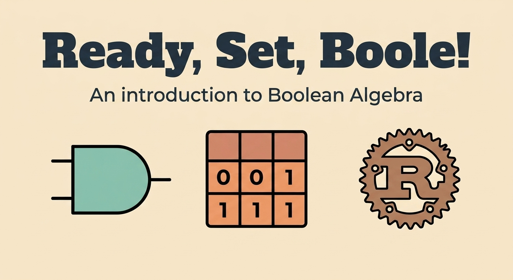

Ready, Set, Boole!

The term "Boolean algebra" honors George Boole (1815–1864), a self-educated English mathematician. He introduced the algebraic system initially in a small pamphlet, The Mathematical Analysis of Logic, published in 1847 in response to an ongoing public controversy between Augustus De Morgan and William Hamilton, and later as a more substantial book, The Laws of Thought, published in 1854. Boole's formulation differs from that described above in some important respects. For example, conjunction and disjunction in Boole were not a dual pair of operations. Boolean algebra emerged in the 1860s, in papers written by William Jevons and Charles Sanders Peirce.

The first systematic presentation of Boolean algebra and distributive lattices is owed to the 1890 Vorlesungen of Ernst Schröder.

## Rust workspaces

To organize my project which is a collection of exercises I will create workspaces.
As described in the Rust docs I first create a directory for the workspace:

``` bash
mkdir ready_set_boole
cd ready_set_boole
```

Then I create the Cargo.toml file:

```yaml
[workspace]
resolver = "3"
```

For each new exercise, I generate the library:

```rust
cargo new ex00 --lib
```

I add the main.rs file manually as required by each exercise.

## linting / formatter

I use the rust-analyzer extension for VS Code and configure my .vscode/settings.json for formatting and linting.

Formatters - Fix code style/spacing:

- rustfmt - Reformats code to follow Rust style conventions
- Example: fn foo(a:u32)->u32{return a;} → fn foo(a: u32) -> u32 { return a; }

Linters - Find bugs/style issues:

- clippy - Suggests improvements and catches common mistakes
- Example: Warns about inefficient code, unused variables, and better idioms.
In my .vscode/settings.json:

```json
"editor.formatOnSave": true,
"editor.defaultFormatter": "rust-lang.rust-analyzer"
```

This uses `rustfmt` to auto-format on save.

```json
"rust-analyzer.checkOnSave.command": "clippy",
"editor.codeActionsOnSave": {
  "source.fixAll.clippy": "explicit"
}
```

This uses `clippy` to check and auto-fix warnings on save.

## boolean algebra precedences

In Boolean algebra, **AND** has higher precedence than **OR**.  
So `A & B | C` is evaluated as `(A & B) | C`, not `A & (B | C)`.

**Precedence order (highest to lowest):**

1. `!` (NOT)
2. `&` (AND)
3. `|` (OR)
4. `^` (XOR)
5. `>` (IMPLY)
6. `=` (EQUIV)

**Examples:**

- `A & B | C` = `(A & B) | C`
- `A | B & C` = `A | (B & C)`
- `!A & B` = `(!A) & B`
- `A & B & C | D` = `((A & B) & C) | D`

This matches most programming languages and standard Boolean algebra notation.

## Rust Documentation

I use `///` for HTML documentation comments, which go above the item being documented:

```rust
/// Adds two numbers using only bitwise operators.
///
/// # Arguments
///
/// * `a` - The first number to add
/// * `b` - The second number to add
///
/// # Examples
///
/// ```
/// use ex00::adder;
/// let answer = adder(2, 2);
/// assert_eq!(4, answer);
/// ```
pub fn adder(a: u32, b: u32) -> u32 {
    // implementation
}
```

### Testing Documentation Examples

Code blocks in doc comments are automatically tested by `cargo test`:

```bash
cargo test --doc
```

This will run all the code examples in my `///` comments to ensure they compile and work correctly.

### Generating and Viewing Documentation

To generate and open the HTML documentation:

```bash
cargo doc --open
```

Or for a specific package in the workspace:

```bash
cargo doc --package ex00 --open
```

This generates HTML documentation in `target/doc/`, includes all public items, and opens it in the default browser.

## Ex00 - Addition

The first exercise uses this function signature:

```rust
fn adder(a: u32, b: u32) -> u32;
```

To test the modules together, I include them in a main binary module (`ready_set_boole_main/Cargo.toml`):

```yaml
[package]
name = "ready_set_boole_main"
version = "0.1.0"
edition = "2024"

[dependencies]
ex00 = { path = "../ex00" }
```

This implements addition using only bitwise operations. It uses the binary addition algorithm with XOR for the sum and AND for carry propagation.

**Algorithm:**

```pseudocode
while b > 0:
carry = a AND b // Find bits that generate a carry
a = a XOR b // Sum without carry
b = carry << 1 // Shift carry left for next position
return a
```

1. XOR computes the sum without carry
2. AND (shifted left) computes the carry
3. Repeat until no carry remains

**Time Complexity:** O(log max(a,b)) ≈ O(32) = O(1) for u32

**Example:**

```text
5 + 3 = 8
0101 (5)
0011 (3)
Step 1: XOR = 0110 (sum without carry)
AND<<1 = 0010 (carry)
Step 2: XOR = 0100 (sum without carry)
AND<<1 = 0100 (carry)
Step 3: XOR = 0000 (sum without carry)
AND<<1 = 1000 (carry = 8)
Result: 1000 = 8
```

See `ex00/src/lib.rs` for detailed documentation.

## Ex01 - Multiplication

This implements multiplication using only bitwise operations. It uses the binary long multiplication algorithm: shift and add based on each bit of the multiplier.

**Algorithm:**
For each bit set in `b`, add `a << bit_position` to the result.

```pseudocode
result = 0
while b > 0:
    if b AND 1 == 1: // Check if lowest bit of b is set
        result = result + a // Add current value of a to result
    a = a << 1 // Shift a left (multiply by 2)
    b = b >> 1 // Shift b right (divide by 2)
return result
```

**Time Complexity:** O(log b) = O(32) = O(1) constant time for u32

1. **O(log b) — The General Case:**
   The algorithm processes each bit of the multiplier `b`. `b` has at most log₂(b) bits.
   Example: `b` = 1000 has ⌈log₂(1000)⌉ = 10 bits. The loop runs once per bit, leading to O(log₂ b) iterations.

2. **O(32) — For u32 Specifically:**
   For the `u32` type, the maximum value is 2³² - 1, which is exactly 32 bits.
   Therefore, log₂(u32::MAX) = 32. The loop runs at most 32 times, leading to O(32).

**Example:**

``` math
3 × 5 = 15

0011 (3)
× 0101 (5)
0011 ← 3 × bit₀
0000 ← 3 × bit₁ (shifted)
0011 ← 3 × bit₂ (shifted)
1111 = 15
```

See `ex01/src/lib.rs` for detailed documentation.

## ex02 - Gray code

Gray code prevents hardware errors by ensuring only one bit changes at a time (e.g., transitioning from 1 to 2 in binary goes from 01 to 10, changing two bits, whereas in Gray code it goes from 01 to 11).

The prototype of the function is:

```rust
fn gray_code(n: u32) -> u32;
```

The formula is incredibly simple using bitwise operators:

```bool
G=n⊕(n≫1)
```

## Ex03

> Write a function that takes as input a string containing a propositional formula in reverse polish notation, evaluates this formula, and returns the result.

### Operator Symbols

| Symbol | Mathematical Equivalent | Description |
| -------- | ------------------------ | ------------- |
| `0` | ⊥ | false |
| `1` | ⊤ | true |
| `!` | ¬ | Negation |
| `&` | ∧ | Conjunction |
| `\|` | ∨ | Disjunction |
| `^` | ⊕ | Exclusive disjunction |
| `>` | ⇒ | Material condition |
| `=` | ⇔ | Logical equivalence |

### The Material Condition (⇒)

The `>` implication in logic is also known as the material condition. Consider the premise: "If it rains (A), then I will bring an umbrella (B)."

There are four possible scenarios:

1. **It rains (A), and I bring an umbrella (B):** The promise is kept. (**True**)
2. **It rains (A), but I don't bring an umbrella (B):** The promise is broken. (**False**)
3. **It doesn't rain (A), but I bring an umbrella anyway (B):** The promise is not broken. (**True**)
4. **It doesn't rain (A), and I don't bring an umbrella (B):** The promise is not broken. (**True**)

The statement is only false when the condition (A) happens, but the result (B) does not.

| A | B | A > B |
| --- | --- | --- |
| 0 | 0 | **1** |
| 0 | 1 | **1** |
| 1 | 0 | **0** |
| 1 | 1 | **1** |

The expression states that either the condition (A) didn't happen, or the result (B) did. If A is false, the entire expression is true regardless of B (vacuous truth). If A is true, B must be true for the expression to remain true.

### Logical Equivalence (⇔)

The `=` symbol represents logical equivalence (also written as $\iff$ or $\equiv$). It means "if and only if" (iff). Two statements are equivalent when they always have the same truth value.

**Example:** "The light is on $\iff$ The switch is up"

- If the light is on, the switch must be up.
- If the switch is up, the light must be on.
- They always agree.

#### Truth Table

| A | B | A = B | Meaning |
| --- | --- | ------- | --------- |
| 0 | 0 | **1** | Both false → They agree   |
| 0 | 1 | **0** | Different → They disagree |
| 1 | 0 | **0** | Different → They disagree |
| 1 | 1 | **1** | Both true → They agree    |

`A = B` is true when A and B have the same value.

#### Equivalence vs Equality

In logic, $A = B$ means A and B always match. This is equivalent to:

$(A \implies B) \land (B \implies A)$

It is also equivalent to:

$(A \land B) \lor (\neg A \land \neg B)$

#### Examples

- Example 1: Mathematical equivalence

```txt
(x > 5) = (x ≥ 6)   for integers

True when x = 7:  (True = True)  → True 
True when x = 3:  (False = False) → True 
```

- Example 2: Logical equivalence

```txt
"It's raining" = "The ground is wet"   (in a controlled scenario)

Both true:  Raining AND ground wet → Equivalent 
Both false: Not raining AND ground dry → Equivalent 
One true, one false: NOT equivalent 
```

- Example 3: Circuit logic

```txt
Switch A = Switch B   (for a two-way light switch)

Both ON:  Light is on → Equivalent 
Both OFF: Light is off → Equivalent 
One ON, one OFF: Light state depends on wiring 
```

#### Connection to XOR (Exclusive OR)

`A = B` is the opposite of  `A ⊕ B`.  

$\neg(A \oplus B) \iff (A = B)$


| A | B | A ⊕ B (XOR) | A = B (Equivalence) |
| --- | --- | ------------- | --------------------- |
| 0 | 0 | 0 (same) | **1** (agree) |
| 0 | 1 | 1 (different) | **0** (disagree) |
| 1 | 0 | 1 (different) | **0** (disagree) |
| 1 | 1 | 0 (same) | **1** (agree) |

#### In Set Theory

In set evaluation, `A = B` represents elements that belong to both sets or belong to neither set:

$(A \cap B) \cup (A^c \cap B^c)$

**Example:**

Universe: $\{1, 2, 3, 4\}$  
A = $\{1, 2\}$  
B = $\{2, 3\}$

A = B:

- Elements in both: $\{2\}$
- Elements in neither: $\{4\}$
- Result: $\{2, 4\}$

#### Practical Applications

1. Digital Circuits (XNOR gate)

```text
A = B creates an XNOR gate
Output is HIGH when inputs match
Used in equality checkers
```

#### Mathematical Notation Variants

Different fields use different symbols:

| Symbol | Meaning | Usage |
|--------|---------|-------|
| `=` | Equivalence | Some logic texts |
| `⇔` | Equivalence | Most logic textbooks |
| `≡` | Equivalence | Some mathematical logic |
| `↔` | Equivalence | Alternative arrow notation |
| `iff` | Equivalence | "If and only if" (written) |

### implementation

The exercises require building an Abstract Syntax Tree (AST).

```text
      OR (|)
     /    \
   AND(&)  C
   /   \
  A     B
```

Here is the node implementation for the AST.

```rust
pub enum Node {
    /// A boolean constant: true (1) or false (0)
    Value(bool),
    ///Will be used in later exercises: holds variable 'A', 'B', etc.
    Variable(char),
    /// Logical NOT: ¬a
    Not(Box<Node>),
    /// Logical AND: a ∧ b
    And(Box<Node>, Box<Node>),
    /// Logical OR: a ∨ b
    Or(Box<Node>, Box<Node>),
    /// Logical XOR: a ⊕ b
    Xor(Box<Node>, Box<Node>),
    /// Material implication: a ⇒ b
    Imply(Box<Node>, Box<Node>),
    /// Logical equivalence: a ⇔ b
    Equiv(Box<Node>, Box<Node>),
}
```

## Ex04 - Truth Table

Generates and displays a complete truth table for a Boolean formula with variables.

**Input:** RPN formula with variables A-Z (e.g., `AB&C|` = `(A ∧ B) ∨ C`)

**Output:** Markdown truth table with all 2^n rows (n = number of variables)

**Algorithm:**

1. Parse RPN formula to AST
2. Extract all variables from the formula
3. Generate all 2^n variable combinations (truth assignments)
4. Evaluate formula for each combination
5. Display as formatted table

**Time Complexity:** $O(2^n)$ where $n$ is the number of variables.
**Space Complexity:** $O(2^n)$ for storing the table.

```txt
Formula: AB&C|
Variables: A, B, C (3 variables → 8 rows)

| A | B | C | Result |
|---|---|---|--------|
| 0 | 0 | 0 |   0    |
| 0 | 0 | 1 |   1    |
| 0 | 1 | 0 |   0    |
| 0 | 1 | 1 |   1    |
| 1 | 0 | 0 |   0    |
| 1 | 0 | 1 |   1    |
| 1 | 1 | 0 |   1    |
| 1 | 1 | 1 |   1    |
```

## Ex05 - Negation Normal Form (NNF)

Converting to Negation Normal Form (NNF) is a tree-to-tree transformation. In NNF, negations (`!`) are only allowed to touch variables. We apply De Morgan's Laws and the Double Negation Law to push the NOT operators down to the leaves.

### 1. Transformation Rules

We need to handle three main scenarios for a `NOT` node:

| Case | Transformation |
| --- | --- |
| **Double Negation** | `Not(Not(A))` → `A` |
| **De Morgan (AND)** | `Not(And(A, B))` → `Or(Not(A), Not(B))` |
| **De Morgan (OR)** | `Not(Or(A, B))` → `And(Not(A), Not(B))` |

Before applying NNF, Implication and Equivalence must be eliminated:

* $A \implies B$ becomes $\neg A \lor B$
* $A = B$ becomes $(A \land B) \lor (\neg A \land \neg B)$

### 2. Rust Implementation

A recursive function `ast_to_nnf(node: Node) -> Node` handles the transformation. The string return value in RPN requires a helper function to convert the tree back into a string.

**Order of Operations:**

1. Convert `>` and `=` into `&`, `|`, and `!`.
2. Push `!` down using the negation rules.
3. Simplify double negations.

## Ex06 - Conjunctive Normal Form (CNF)

Converts a Boolean formula to Conjunctive Normal Form, which is required for SAT solvers and automated reasoning systems.

**Requirement:**

- Every negation (`!`) appears directly after a variable.
- Every conjunction (`&`) appears at the end of the formula.
- Result is an AND of ORs: $(A \lor B \lor C) \land (D \lor E) \land F$

**Input:** RPN formula (e.g., `AB&!`)  
**Output:** Equivalent CNF formula (e.g., `A!B!|`)

### Structure of CNF

CNF represents Boolean formulas as a product of sums:

$(Clause_1) \land (Clause_2) \land (Clause_3)$

Where each clause is an OR of literals:
$(A \lor B \lor \neg C) \land (\neg A \lor D) \land (B \lor \neg D)$

CNF is the standard input format for SAT solvers because it allows for efficient evaluation (short-circuiting if any clause fails) and naturally represents constraints.

### The Algorithm

**Step 1: Convert to NNF**
- Push all negations down to variables.
- Eliminate `>` and `=` operators.

**Step 2: Apply Distributivity**
- Use the law: $A \lor (B \land C) \iff (A \lor B) \land (A \lor C)$
- Recursively distribute OR over AND.

**Step 3: Flatten to RPN**
- Convert AST back to RPN string.
- Ensure ANDs appear at the end.

### Distributivity Law for CNF

The key transformation relies on this law:

$A \lor (B \land C) \iff (A \lor B) \land (A \lor C)$

**Opposite law (used for DNF):**
$A \land (B \lor C) \iff (A \land B) \lor (A \land C)$

### Implementation Sketch

```rust
pub fn conjunctive_normal_form(formula: &str) -> String {
    let tree: Node = match parse_rpn(formula) {
        Ok(t) => t,
        Err(e) => {
            eprintln!("Error parsing formula: {}", e);
            std::process::exit(1);
        }
    };
    
    let nnf_tree = ast_to_nnf(&tree);
    let cnf_tree = to_cnf(nnf_tree);
    ast_to_rpn(&cnf_tree)
}
```

**Visual example:**

```txt
      OR                AND
     /  \              /   \
    A   AND    →    OR     OR
       /  \         / \    / \
      B   C        A  B   A  C
```

### Time Complexity

The worst-case time complexity is exponential in relation to the formula size. Distributivity can cause exponential growth when fully distributed, resulting in $2^n$ clauses.

### Karnaugh Maps (K-Maps)

K-Maps are a visual method used to simplify CNF/DNF by eliminating redundant terms. While generating a valid CNF using distributivity is required for the exercise, K-Maps can find redundancies to produce a minimal CNF.

1. Draw a truth table as a 2D grid using Gray code ordering.
2. Mark cells where the formula equals 1.
3. Group adjacent 1s in powers of 2.
4. Extract simplified terms from the groups.

K-Map simplification is an optional approach for optimizing the output, whereas the standard distributive law is sufficient for producing correct CNF structure.

**Example: `AB|A!B|` → `A`**
My CNF might be correct but **redundant**:

```txt
(A | B) & (A | ¬B) = A   ← Can be simplified
```

K-Maps find these redundancies to produce **minimal CNF**.


```txt
    B  ¬B
A   1   1   ← Both cells are 1, group them
¬A  0   0
```

Group covers both B values → **B is irrelevant** → Result: `A`

#### Advantages

For **digital circuit design:**

- Fewer logic gates = cheaper hardware
- Faster circuits (fewer propagation delays)
- Lower power consumption


## Ex07 - SAT (Boolean Satisfiability)

### Boolean Satisfiability (SAT)

A Boolean formula is **satisfiable** if there exists at least one assignment of variable values that makes the entire formula evaluate to `true`.

### SAT Classification

- **Satisfiable**: At least one row in the truth table outputs `true`
- **Unsatisfiable (Contradiction)**: All rows output `false` (e.g., `A & !A`)
- **Tautology**: All rows output `true` (always satisfiable)

### Algorithm

1. Parse the RPN formula into an Abstract Syntax Tree (AST)
2. Extract all variables from the formula
3. Generate a complete truth table (all 2^n variable combinations)
4. Check if any row evaluates to `true`
5. Return `true` if found, `false` otherwise

### Time Complexity

O(2^n) where n is the number of variables (exponential)

## Ex08 - Powerset

### Powerset Definition

A Powerset of a set S is the set of all possible subsets, including the empty set and S itself. If a set has n elements, the powerset will have 2^n elements.

### Example

For set [1, 2, 3], the powerset contains 8 subsets:

```text
[]
[1]
[2]
[1, 2]
[3]
[1, 3]
[2, 3]
[1, 2, 3]
```
*(Note: please remove the spaces between the backticks above and below when copying)*

### Binary Enumeration Algorithm

This algorithm uses **binary counting** to generate powersets:

```rust
pub fn powerset(set: Vec<i32>) -> Vec<Vec<i32>> {
    let n = set.len();
    let num_subset = 1 << n;  // 2^n
    let mut results = Vec::with_capacity(num_subset);

    for i in 0..num_subset {
        let mut subset: Vec<i32> = Vec::new();
        for j in 0..n {
            if (i >> j) & 1 == 1 {
                subset.push(set[j]);
            }
        }
        results.push(subset);
    }
    results
}
```

### Mechanism

**Each subset corresponds to a binary number**.

For a set of `n` elements, we have `2^n` subsets. Each subset can be represented as an `n`-bit binary number:

```text
For [1, 2, 3]:
Binary  Decimal  Subset
000   →   0    → []
001   →   1    → [1]
010   →   2    → [2]
011   →   3    → [1, 2]
100   →   4    → [3]
101   →   5    → [1, 3]
110   →   6    → [2, 3]
111   →   7    → [1, 2, 3]
```

The algorithm iterates from 0 to 2^n - 1. For each number i:

- Check each bit position j
- If bit j is set, include element j in the subset

## Boolean Lattices

### Lattice Definition

A **lattice** is a partially ordered set (poset) in which every pair of elements has:

1. A **least upper bound** (supremum, or "join") - denoted ∨
2. A **greatest lower bound** (infimum, or "meet") - denoted ∧

In this structure:

- The join is the smallest element greater than both inputs.
- The meet is the largest element smaller than both inputs.

### Visual Example: The Powerset Lattice

The powerset generated in Ex08 forms a **Boolean lattice**. Here is the lattice for {1, 2}:

```text
        {1, 2}         ← Top (universal set)
         /  \
      {1}   {2}        ← Single elements
         \  /
          {}           ← Bottom (empty set)
```

**Ordering**: A ⊆ B means "A is below B in the lattice"

**Operations**:

- Join (∨): {1} ∨ {2} = {1, 2} (union)
- Meet (∧): {1} ∧ {2} = {} (intersection)

### The Full {1, 2, 3} Boolean Lattice

```text
               {1,2,3}
              /   |   \
          {1,2} {1,3} {2,3}
             |/  \ /  \ |
            {1}  {2}  {3}
               \  |  /
                 {}
```

### Properties of Boolean Lattices

A **Boolean lattice** (or Boolean algebra) has these properties:

1. **Complementation**: Every element has a complement
   - {1} ∪ {2,3} = {1,2,3}
   - {1} ∩ {2,3} = {}

2. **Distributivity**:
   - A ∨ (B ∧ C) = (A ∨ B) ∧ (A ∨ C)
   - A ∧ (B ∨ C) = (A ∧ B) ∨ (A ∧ C)

3. **De Morgan's Laws**:
   - ¬(A ∧ B) = ¬A ∨ ¬B
   - ¬(A ∨ B) = ¬A ∧ ¬B

4. **Identity Elements**:
   - Top (⊤): {1,2,3} (universal set)
   - Bottom (⊥): {} (empty set)

5. **Size**: A Boolean lattice with n atoms has exactly 2^n elements

### Lattice Verification

**Test: Does every pair have a join and meet?**

Take any two elements and find:
- Their least upper bound
- Their greatest lower bound

**Example - This is a lattice:**

```bool
    6
   / \
  2   3
   \ /
    1
```

- join(2,3) = 6 ✓
- meet(2,3) = 1 ✓

**Example - This is NOT a lattice:**

```bool
    ?
   / \
  2   3
  |   |
  4   9
   \ /
    1
```

- What's join(2,3)? Could be 6, 12, 18. There is no unique least upper bound.

### Boolean Lattices vs General Lattices

Not all lattices are Boolean:

**Boolean Lattice** (e.g., powersets):

```bool
- Has complements
- Is distributive
- Has 2^n elements for n atoms
- Examples: Powerset, Boolean circuits
```

**Non-Boolean Lattice** (e.g., divisibility):

```bool
Divisors of 12: {1, 2, 3, 4, 6, 12}

    12
   / \
  4   6
  | / |
  2   3
   \ /
    1
```

This is a lattice (join = LCM, meet = GCD) but NOT Boolean:

- **No complement for 2**: We need `x` where `LCM(2, x) = 12` AND `GCD(2, x) = 1`
  - Try 6: `LCM(2, 6) = 6` ✗ (not 12), `GCD(2, 6) = 2` ✗ (not 1)
  - Try 3: `LCM(2, 3) = 6` ✗ (not 12), `GCD(2, 3) = 1` ✓ (but LCM fails)
  - No element in the lattice satisfies both conditions.
- Not 2^n elements (has 6 elements, not a power of 2)

### Project Context

The Boolean algebra exercises operate within a Boolean lattice:

- **Ex00-Ex03**: Operations (∧, ∨, ¬) in the 2-element lattice {0, 1}
- **Ex05 (NNF)**: Pushing ¬ down preserves lattice structure
- **Ex06 (CNF)**: Distributivity law from Boolean lattices
- **Ex07 (SAT)**: Finding if formula reaches ⊤ (true)
- **Ex08 (Powerset)**: Building the entire Boolean lattice

**Mathematical Note**: Every finite Boolean lattice is isomorphic to the powerset lattice of some finite set. This connection is why the Ex08 powerset exercise is fundamental to understanding Boolean algebra.

## Material Implication with Sets

In logic, the **Material Implication** is defined as "If A, then B." When translated into Set Theory, it represents the relationship: **"Everything that is NOT in A, OR everything that is in B."**

The formula is: A^c ∪ B (where U is the Universe).

### Example Evaluation

Using specific inputs:

* **Set A:** `{1, 2}`
* **Set B:** `{2, 3}`
* **Universe (U):** `{1, 2, 3}` (The union of all elements involved)

#### Step 1: Find "NOT A" (The complement)

"NOT A" (A^c) means all elements in the Universe that are **not** in Set A.

* Universe is `{1, 2, 3}`.
* A is `{1, 2}`.
* **A^c is `{3}`**.

#### Step 2: Perform the "OR" (Union) with B

Take the result of A^c and combine it with everything in Set B.

* A^c is `{3}`.
* B is `{2, 3}`.
* `{3} | {2, 3}` results in `{2, 3}`.

| A | B | A > B |
| --- | --- | --- |
| 1 | 1 | **1** (Element is in both) |
| 1 | 0 | **0** (Element in A but NOT in B — The only "False" case) |
| 0 | 1 | **1** (Element not in A, but in B) |
| 0 | 0 | **1** (Element in neither) |

**Checking the numbers against the table:**

* **Number 1:** In A (1), Not in B (0). Table says **0**. (1 is excluded).
* **Number 2:** In A (1), In B (1). Table says **1**. (**2 is included**).
* **Number 3:** Not in A (0), In B (1). Table says **1**. (**3 is included**).

In the example `[[1, 2], [2, 3]]`, the result for **Equivalence** (`=`) and **Intersection** (`&`) is exactly the same: `[2]`.

The difference only appears when there are elements in the **Universe** that **neither** set contains.

### Equivalence vs Intersection

Consider this scenario:

* **Universe (U):** `{1, 2, 3, 4}`
* **Set A:** `{1}`
* **Set B:** `{1}`

#### 1. Intersection (`AB&`)

* "What is in both?"
* **Result: `{1}`**

#### 2. Equivalence (`AB=`)

* "Where do they agree?"
* They agree on **1** (both have it).
* They **also** agree on **2, 3, and 4** (neither has them).
* **Result: `{1, 2, 3, 4}`**

In this case, `AB=` outputs the entire Universe because A and B are identical. 

## Bonus

The objective is to write a function (the inverse of a space-filling curve, used to encode spatial data into a line) that takes a pair of coordinates in two dimensions and assigns a unique value in the closed interval `[0; 1] ∈ R`.

### Reading Mathematical Function Notation

```txt
Let f be a function and let A be a set such as:
f : (x, y) ∈ [[0; 2¹⁶ - 1]]² ⊂ ℕ² → A
A ⊂ [0; 1] ⊂ ℝ
```

**Line 1: The Domain (Input)**

```text
f : (x, y) ∈ [[0; 2¹⁶ - 1]]² ⊂ ℕ²
```

Reading from right to left:

1. **ℕ²** = "The Cartesian product ℕ × ℕ" = All pairs of natural numbers.
2. **[[0; 2¹⁶ - 1]]²** = "The closed interval from 0 to 2¹⁶ - 1, squared". This means pairs (x, y) where both x and y are in [0, 65535].
3. **⊂** = "is a subset of". Our specific range is a subset of all natural number pairs.
4. **(x, y) ∈** = "the pair (x, y) belongs to".
5. **f :** = "the function f maps from".

**Translation:**
"f is a function that takes pairs (x, y) from the 2D grid of integers ranging from 0 to 2¹⁶ - 1 (65535)."

**Line 2: The Codomain (Output Range)**

```text
A ⊂ [0; 1] ⊂ ℝ
```

Reading from right to left:

1. **ℝ** = "The real numbers" = All numbers on the number line.
2. **[0; 1]** = "The closed interval from 0 to 1". All real numbers between 0 and 1, inclusive.
3. **A ⊂** = "A is a subset of".

**Translation:**
"The set A (where f maps to) is a subset of the interval [0, 1], which itself is a subset of all real numbers."

### Complete Translation

**Definition:**
"Let f be a function that maps pairs of integers (x, y), where both x and y range from 0 to 65535, into some set A. The set A contains real numbers between 0 and 1."

**Code representation:**

```rust
fn f(x: u16, y: u16) -> f64 {
    // x ranges from 0 to 65535
    // y ranges from 0 to 65535
    // Output is a float between 0.0 and 1.0
}
```

### Breaking Down the Notation

#### Domain Notation: [[0; 2¹⁶ - 1]]²

**[[a; b]]** = Closed interval of integers from a to b.

- The double brackets [[...]] indicate **discrete** (integer) values.
- Single brackets [...] indicate **continuous** (real) values.

**The "²" exponent:**

- Denotes the Cartesian product with itself.
- [[0; 2¹⁶ - 1]]² = [[0; 2¹⁶ - 1]] × [[0; 2¹⁶ - 1]]

**Range calculation:**

- 2¹⁶ = 65536 (the number of values a u16 can hold)
- 2¹⁶ - 1 = 65535 (the maximum value for u16)
- Range: [0, 65535] = all u16 values

#### Codomain Notation: A ⊂ [0; 1] ⊂ ℝ

**[0; 1]** = Closed interval of reals from 0 to 1.

- Single brackets [...] indicate **continuous** (real) values.
- Includes 0, 1, and every real number in between.

**Subset chain:**
```txt
A ⊂ [0; 1] ⊂ ℝ
A is inside [0; 1], which is inside ℝ
```

This indicates:
1. A contains some (possibly all) numbers from [0, 1].
2. All numbers in A are real numbers.
3. All numbers in A are between 0 and 1.

### Ex10

```text
function:
f : (x, y) ∈ [[0; 2¹⁶ - 1]]² ⊂ ℕ² → A
A ⊂ [0; 1] ⊂ ℝ
```

**Rust implementation:**

```rust
pub fn map(x: u16, y: u16, n: u16) -> f64 {
    // Domain: (x, y) where x, y ∈ [0, 65535]
    // Codomain: f64 value in [0.0, 1.0]
}
```

**Interpretation:**
1. **Input:** A coordinate pair (x, y) on a 65536 × 65536 grid.
2. **Output:** A single real number between 0 and 1.
3. **Purpose:** Map 2D discrete space to a 1D continuous interval.

### Visual Representation

```text
Domain (Input Space):
┌─────────────────────┐
│  (0, 65535)  65535  │
│                     │  ← 2D Grid of integers
│                     │     65536 × 65536 points
│      (x, y)         │
│                     │
│  (0, 0)      65535  │
└─────────────────────┘

         ↓ f maps to

Codomain (Output Space):
├─────────────────────┤
0                     1  ← Real number line
                          Continuous values
                          
Example mappings:
f(0, 0) = 0.0
f(65535, 65535) = 1.0
```

### Notation Cheat Sheet

| Symbol | Meaning | Example |
|--------|---------|---------|
| **[[a; b]]** | Discrete interval (integers) | [[0; 5]] = {0, 1, 2, 3, 4, 5} |
| **[a; b]** | Continuous interval (reals) | [0; 1] = {all reals from 0 to 1} |
| **A²** | Cartesian product A × A | ℕ² = ℕ × ℕ = pairs of naturals |
| **⊂** | Subset (contained in) | {1, 2} ⊂ ℕ |
| **∈** | Element of (belongs to) | 5 ∈ ℕ |
| **→** | Maps to | f: A → B |
| **ℕ** | Natural numbers | {0, 1, 2, 3, ...} |
| **ℝ** | Real numbers | All numbers on number line |

**Implementation requirement:**

```text
To satisfy the requirement that card(A) = 2^32, we interleave the 16 bits of x and 16 bits of y into a single u32. 
Then, we map that u32 into the range [0, 1].
```

1. **Step 1: Bit Interleaving** (Creates the bijection)
   - Combine 16 bits of x and 16 bits of y into a single u32.
   - This creates the space-filling curve ordering.
   - Result: 2^32 unique values (one for each grid point).

2. **Step 2: Normalization** (Maps to [0, 1])
   - Take the u32 result.
   - Map it to a real number in [0, 1].
   - This is achieved by dividing by u32::MAX.

- The function must be bijective = 2^32).
- It must normalize to [0, 1].

### Comparing the Three Curves

#### 1. Z-Order Curve (Lebesgue / Morton Code)

**How it works:**

```text
Bit interleaving of x and y coordinates:

x = 0b 0101 0011 (binary)
y = 0b 1100 1010 (binary)

Interleave bits (y,x):
Result = 0b 10_11_00_01_10_00_11_01

Pattern: y₁₅ x₁₅ y₁₄ x₁₄ ... y₀ x₀
```

- Computationally fast (O(16) operations).
- Creates a Z-pattern at each scale.

**Visual Pattern:**

```text
┌─────┬─────┐
│ ┌─┐ │ ┌─┐ │
│ │0│ │ │1│ │
│ └─┘ │ └─┘ │
├─────┼─────┤
│ ┌─┐ │ ┌─┐ │
│ │2│ │ │3│ │
│ └─┘ │ └─┘ │
└─────┴─────┘

Forms Z-shape at each level of subdivision
```

**The Z shape matrix:**

```text
4×4 grid:
┌────┬────┬────┬────┐
│  0 │  1 │  4 │  5 │     0→1   4→5
│    │    │    │    │     ↓  ↘  ↓  ↘
├────┼────┼────┼────┤     2─→3  6─→7
│  2 │  3 │  6 │  7 │
│    │    │    │    │     8→9  12→13
├────┼────┼────┼────┤     ↓  ↘  ↓  ↘
│  8 │  9 │ 12 │ 13 │    10→11 14→15
│    │    │    │    │
├────┼────┼────┼────┤  
│ 10 │ 11 │ 14 │ 15 │
└────┴────┴────┴────┘
```

## Ex11: Inverse Function and Function Composition

### Inverse Functions

An **inverse function** f⁻¹ reverses the operation of f. If f maps from A to B, then f⁻¹ maps from B back to A.

**Notation:**

```text
f : A → B     (forward function)
f⁻¹ : B → A   (inverse function)
```

### Function Composition Laws

The exercise requires two properties to hold:

```text
(f⁻¹ ∘ f)(x, y) = (x, y)
(f ∘ f⁻¹)(x) = x
```

These express the identity mapping in both directions.

### Law 1: (f⁻¹ ∘ f)(x, y) = (x, y)

**Definition:** f inverse composed with f equals the identity mapping.

```text
(f⁻¹ ∘ f)(x, y) means: f⁻¹(f(x, y))
                       └──┬──┘  └─┬─┘
                         Apply f first
                              Then apply f⁻¹
```

**Evaluation:**

```text
Input: (x, y) ∈ [[0; 2¹⁶ - 1]]²

Step 1: Apply f
        f(x, y) = some_value ∈ [0, 1]
        Result: a single float

Step 2: Apply f⁻¹
        f⁻¹(some_value) = (x, y)
        Result: original 2D coordinate

Expected: (x, y)  ← Returns the original coordinate pair
```

Since f is a **bijection** (one-to-one, onto), every point in [0, 1] maps from exactly one (x, y) pair. Applying f⁻¹ to that point returns the original (x, y).

**Example:**

```text
f(100, 200) = 0.001234567
f⁻¹(0.001234567) = (100, 200)

(f⁻¹ ∘ f)(100, 200) = f⁻¹(f(100, 200)) = f⁻¹(0.001234567) = (100, 200) ✓
```

### Law 2: (f ∘ f⁻¹)(x) = x

**Definition:** f composed with f inverse equals the identity mapping.

```text
(f ∘ f⁻¹)(x) means: f(f⁻¹(x))
                    └───┬───┘  └┬┘
                    Apply f⁻¹ first
                          Then apply f
```

**Evaluation:**

```text
Input: x ∈ [0, 1]

Step 1: Apply f⁻¹
        f⁻¹(x) = some (a, b) ∈ [[0; 2¹⁶ - 1]]²
        Result: a 2D coordinate pair

Step 2: Apply f
        f(a, b) = x
        Result: original float

Expected: x  ← Returns the original float value
```

Since f⁻¹ is the inverse, it maps [0, 1] back to [[0; 2¹⁶ - 1]]². Applying f to that coordinate pair returns the original float value.

**Example:**
```text
f⁻¹(0.001234567) = (100, 200)
f(100, 200) = 0.001234567

(f ∘ f⁻¹)(0.001234567) = f(f⁻¹(0.001234567)) = f(100, 200) = 0.001234567 ✓
```

| Law | Direction | Meaning |
|-----|-----------|---------|
| **(f⁻¹ ∘ f)** | 2D → 1D → 2D | Inverse maps float back to original coordinates |
| **(f ∘ f⁻¹)** | 1D → 2D → 1D | Function maps coordinates back to original float |

## Links

[https://doc.rust-lang.org/stable/book/index.html](https://doc.rust-lang.org/stable/book/index.html)
